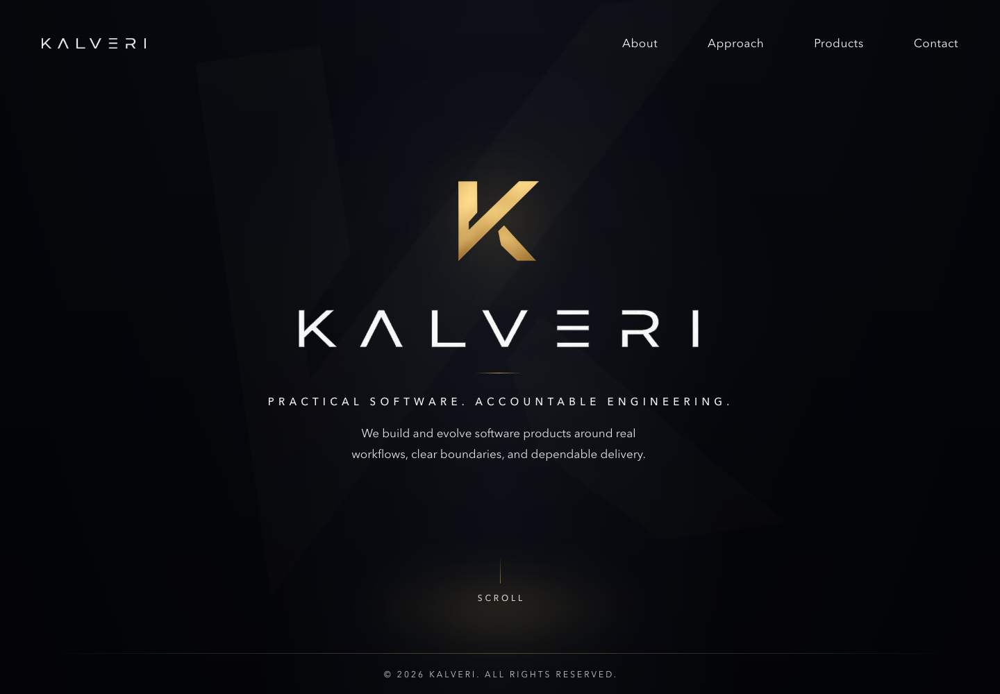
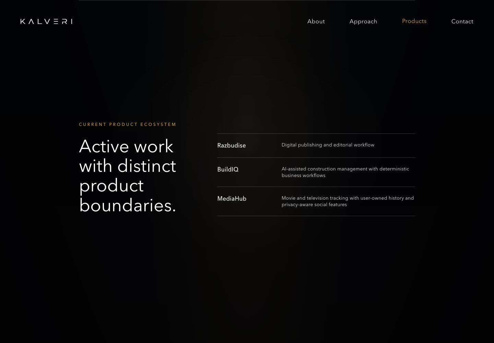
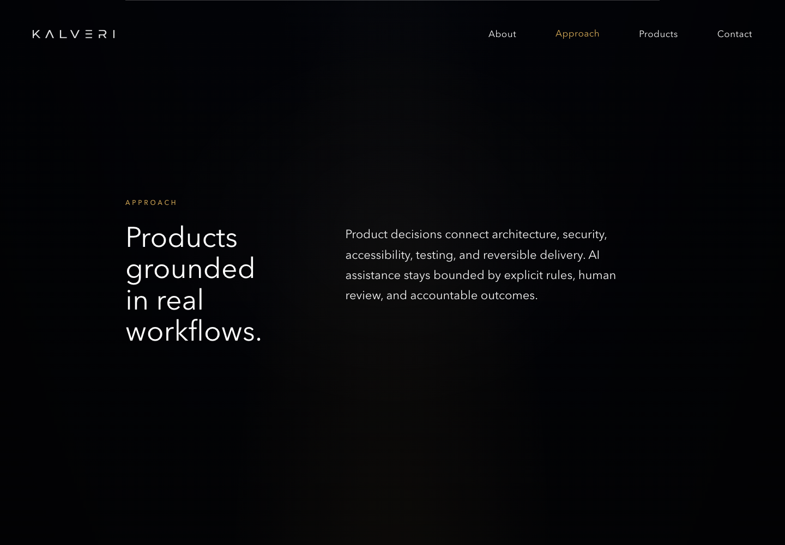
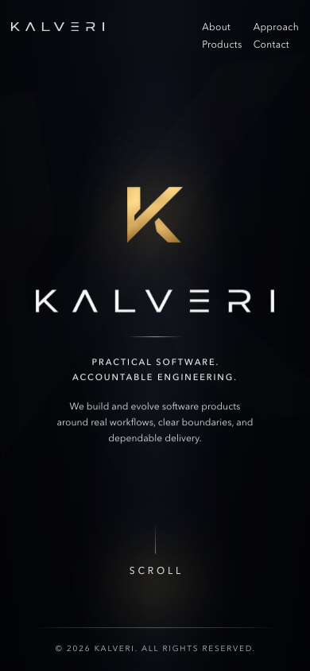

# Kalveri company website

**Status:** Active company website · source-visible · maintained privately

This repository contains the public website for Kalveri, a software company and product ecosystem focused on practical business software, SaaS products, publishing systems, and accountable AI-assisted engineering.

## Purpose

The website presents Kalveri's public positioning, engineering approach, current product ecosystem, and contact path. It is a company website—not a shared platform, product monorepo, infrastructure repository, customer portal, or AI operating platform.

## Company positioning

Kalveri builds and evolves software around real workflows, explicit boundaries, security, accessibility, testing, and reversible delivery. Public materials distinguish active work from future direction and do not claim customers, revenue, funding, employees, market traction, or commercial success.

## Current product ecosystem

- **BuildIQ** — AI-assisted construction management with deterministic business workflows
- **MediaHub** — movie and television tracking with user-owned history and privacy-aware social features
- **Razbudise** — digital publishing and editorial workflow

These products are active work. Inclusion here does not imply that each product is commercially launched.

## Technology stack

- Semantic HTML
- Responsive CSS
- Static assets and structured metadata
- Node-based validation, Playwright, and axe-core
- GitHub Actions for build, quality, accessibility, dependency, and secret checks

## Design and accessibility

The interface uses the Kalveri wordmark, gold mark, a dark editorial system, responsive layouts, keyboard-visible focus, a skip link, semantic landmarks, and reduced-motion behavior. Screenshots use only the public website and are governed by the [screenshot policy](docs/002-kalveri-screenshot-policy.md).

## Local development

Prerequisites: Node.js 22+ and npm 10+.

```bash
npm ci
npm run dev
```

The local preview uses an ephemeral loopback server and does not require production configuration.

## Build and validation

```bash
npm run lint
npm test
npm run build
npm run test:a11y
npm audit --audit-level=high
```

The static build is written to `dist/`. Validation covers HTML, CSS, metadata, internal links, assets, public-evidence boundaries, and an accessibility smoke test.

## Screenshots

| Homepage | Product ecosystem |
| --- | --- |
|  |  |

| Engineering approach | Mobile homepage |
| --- | --- |
|  |  |

## Documentation

- [Architecture](docs/architecture.md)
- [Public-state audit](docs/001-github-professionalization-kalveri-audit.md)
- [Screenshot policy](docs/002-kalveri-screenshot-policy.md)
- [Asset strategy](docs/003-kalveri-asset-strategy.md)
- [Dependency review](docs/004-kalveri-dependency-review.md)
- [Optional rename plan](docs/005-kalveri-repository-rename-plan.md)
- [Main-promotion plan](docs/006-kalveri-main-promotion-plan.md)
- [Professionalization review](docs/007-github-professionalization-kalveri-review.md)

## Security

Please follow [SECURITY.md](SECURITY.md). Do not publish vulnerabilities, credentials, private infrastructure, customer information, or operational topology in issues.

## Deployment principles

A release should identify a reviewed commit, produce a validated static build, preserve a recovery point, replace files atomically, run public smoke checks, and retain a tested rollback path. Environment-specific commands, hosts, accounts, certificates, DNS, mail configuration, and backup locations remain outside this public repository.

## License status

No public license has been granted. The repository is proprietary source-visible pending approved legal wording; public visibility does not grant reuse rights to code or artwork.

## Disclaimer

Kalveri's public product references describe active engineering work, not guaranteed availability, adoption, customer relationships, revenue, funding, staffing, or commercial results.
