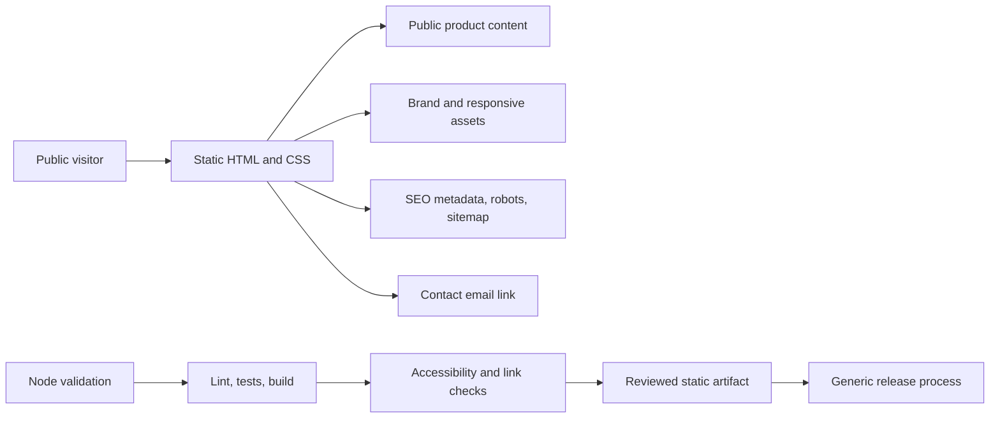

# Kalveri website architecture

Kalveri is a static company website built from semantic HTML, responsive CSS, structured metadata, and project-owned identity assets. It has no application backend, customer portal, private API, analytics tracker, or runtime package dependency.

## Content and product boundaries

Public company positioning and approved active-product summaries live directly in `index.html`. This repository does not contain product source code, internal strategy, customer data, pricing, private roadmaps, or infrastructure configuration. External product details should link only to reviewed public evidence.

## Build and asset pipeline

`scripts/build.mjs` creates `dist/` from an explicit allowlist. Source-master artwork and repository documentation are intentionally excluded from the public artifact. Runtime derivatives and favicons are copied without transformation; the editable social-preview SVG is the source for its PNG derivative.

## SEO and metadata

The page provides a canonical URL, unique title and description, Open Graph and Twitter metadata, Organization and WebSite JSON-LD, `robots.txt`, `sitemap.xml`, a web manifest, and a public verification file. Tests parse the JSON-LD and confirm canonical references and local assets.

## Accessibility

The document uses semantic header, navigation, main, section, list, and footer landmarks; one H1; a skip link; visible keyboard focus; responsive layouts; decorative-image treatment; and reduced-motion behavior. Playwright and axe-core provide an automated smoke gate, supplemented by manual keyboard and responsive review.

## Contact and external links

Contact uses a public `mailto:` link and sends no data through repository-owned JavaScript. Any future external link must be intentional, public, and clearly outside the website's trust boundary.

## Deployment principles

A reviewed release identifies an exact commit, builds a validated static artifact, preserves a recovery point, replaces files atomically, runs public smoke checks, and retains rollback capability. Hostnames, accounts, paths, certificates, DNS, mail, backup locations, and exact commands remain private.
